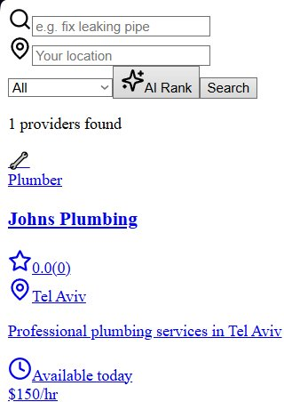

# LocalPro

A full-stack local services marketplace connecting clients with verified professionals.


---

## Live Demo

Search page running against a live PostgreSQL (Supabase) database with PostGIS geo queries:



Clients search for local professionals by keyword, location, and category. Results are pulled live from the database and can be AI-ranked by Claude based on relevance to the user's query.

---

## Features

- **Smart Search** — keyword, location, and category filters backed by PostGIS radius queries
- **AI Ranking** — Claude scores and explains provider matches in natural language
- **Stripe Payments** — full payment flow with Stripe Elements; platform takes 15% via `application_fee_amount`
- **Stripe Connect** — providers onboard as Express accounts and receive automatic payouts
- **Stripe Identity** — document and selfie verification for providers
- **Google Places** — server-side autocomplete proxy (API key never exposed to browser)
- **SendGrid Email** — booking confirmation, provider notification, and day-before reminder templates
- **JWT Auth** — HTTP-only cookie for SSR and Bearer token for mobile (Phase 2 ready)

---

## Tech Stack

| Layer | Technology |
|---|---|
| Frontend | Next.js 14 (App Router) · React 18 · TypeScript · Tailwind CSS |
| Backend | Next.js API Routes (Node.js runtime) |
| Database | PostgreSQL 15 + PostGIS (geo queries) |
| Payments | Stripe Payments + Stripe Connect (provider payouts) |
| Identity | Stripe Identity (document + selfie verification) |
| Maps | Google Places API (autocomplete, geocoding, place details) |
| Email | SendGrid (transactional — confirmation, reminders) |
| AI | Anthropic Claude (provider ranking + profile summaries) |

---

## Project Structure

```
localpro/
├── schema.sql                      # Full PostgreSQL schema — UUID PKs, PostGIS, JSONB, triggers
├── types/index.ts                  # Shared TypeScript domain types
├── lib/
│   ├── db.ts                       # pg Pool singleton, query helpers, transaction wrapper
│   ├── stripe.ts                   # Payments, Connect onboarding, Identity sessions
│   ├── email.ts                    # SendGrid HTML templates + email audit log
│   ├── places.ts                   # Google Places autocomplete, geocoding, PostGIS builder
│   ├── ai.ts                       # Claude-powered recommendations & profile summaries
│   └── auth.ts                     # JWT sign/verify, getAuthUser middleware
└── src/app/
    ├── api/
    │   ├── auth/route.ts           # POST /api/auth — login + register
    │   ├── search/route.ts         # GET  /api/search — geo + category + AI ranking
    │   ├── bookings/route.ts       # GET/POST /api/bookings — create booking + PaymentIntent
    │   ├── places/route.ts         # GET  /api/places — server-side autocomplete proxy
    │   ├── identity/route.ts       # POST/GET /api/identity — Stripe Identity sessions
    │   └── payments/webhook/       # POST — Stripe webhook handler
    ├── search/page.tsx             # Search UI with AI ranking toggle
    ├── checkout/page.tsx           # Stripe Elements checkout page
    └── components/
        ├── ui/AddressAutocomplete.tsx   # Debounced Google Places input
        └── provider/ProviderCard.tsx    # Provider listing card with AI score badge
```

---

## Key Integration Details

### Stripe Payments + Connect
- Every provider onboards as a Stripe Express connected account
- `createBookingPaymentIntent()` uses `transfer_data` + `application_fee_amount` — the platform takes 15% automatically, no manual splitting
- Webhooks (`payment_intent.succeeded` / `payment_intent.payment_failed`) drive booking status — never trusting the client response

### Stripe Identity
- `POST /api/identity` creates a `VerificationSession` with document + live selfie requirements
- Returns a `client_secret` for Stripe's built-in Identity modal
- `identity.verification_session.verified` webhook flips `providers.identity_verified = true` in the DB

### Google Places
- All calls are server-side only — the API key is never sent to the browser
- `GET /api/places?input=...` acts as a proxy returning autocomplete results safely
- `geocodeAddress()` converts text to lat/lng for PostGIS distance queries
- `buildGeoQuery()` generates `ST_DWithin` clauses with proper meter radius conversion

### SendGrid
- Three HTML email templates: booking confirmation, provider notification, day-before reminder
- Every send is logged to `email_log` with SendGrid's `x-message-id` for delivery auditing
- Sends are fire-and-forget so email failures never block the booking API response

### AI (Claude)
- `getAIRecommendations()` sends provider summaries to Claude and receives ranked results with scores (0-100) and natural language reasons
- Displayed as "AI Match 87%" badges on provider cards
- `generateProviderSummary()` uses claude-haiku for fast, low-cost profile copy generation

### Database Design
- UUID primary keys via uuid-ossp extension
- PostGIS `GEOGRAPHY(POINT)` on `providers.location` for accurate km-distance queries
- JSONB `availability` stores weekly time slots without extra join tables
- Trigger `update_provider_rating` auto-recalculates provider rating on every new review
- Amounts stored in cents (integers) throughout — no floating-point money bugs

---

## Setup

```bash
# 1. Install dependencies
npm install

# 2. Configure environment
cp .env.example .env.local
# Fill in: Stripe, Google Places, SendGrid, Anthropic, DATABASE_URL

# 3. Run schema against your PostgreSQL DB
psql $DATABASE_URL < schema.sql

# 4. Start dev server
npm run dev
```

Stripe webhooks (local dev):
```bash
stripe listen --forward-to localhost:3000/api/payments/webhook
```

Required environment variables:
```
DATABASE_URL=postgresql://...
STRIPE_SECRET_KEY=sk_test_...
NEXT_PUBLIC_STRIPE_PUBLISHABLE_KEY=pk_test_...
STRIPE_WEBHOOK_SECRET=whsec_...
GOOGLE_PLACES_API_KEY=AIza...
SENDGRID_API_KEY=SG....
ANTHROPIC_API_KEY=sk-ant-...
JWT_SECRET=...
```

---

## Phase 2 — React Native

The backend is designed from day one to support a mobile app on the same API:

- JWT Bearer tokens work identically for mobile (`Authorization: Bearer <token>`)
- All API routes return a consistent `{ success, data } | { success, error }` envelope
- Stripe React Native SDK accepts the same `clientSecret` from `POST /api/bookings`
- Stripe Identity has a React Native SDK using the same `client_secret`
- Google Places via `@react-native-google-places/autocomplete` pointing at `/api/places`
